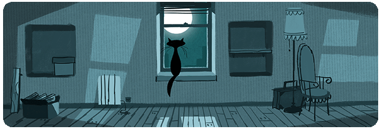

# Hello there! ⭐🖋

*My name is Julie, I am a 2nd year student from IIM digital school. I like reading, video games and traveling.*

>🌹 I am available everyday from 10am to 8pm.

 

 <h6 align="center">

 

</h6>

- 🌷 I am currently learning HTML, CSS, Javascript and PHP
- 🌸 Pronouns: she/her
- 🐱 I am open to talk about anything
- 💌 How to reach me: julie1480@hotmail.fr

## **Languages 📚**
- French
- English

## **My personal goals 🧭 :**

-  Travel around the world to meet my friends
-  Make a game for myself
-  Graduate school with good competences
-  Learn more languages

## Connect with me:

## My stats 📈 :

## 🌙 To end my introduction, here's a quote:

> *“I don’t always write code, but when I do, I make sure it’s elegant and efficient. Just kidding, I just hope it works!”*
